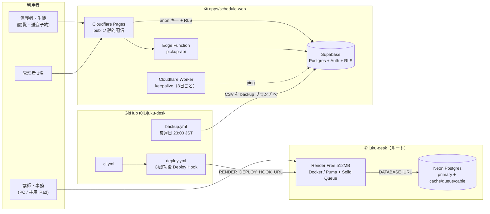

# ARCHITECTURE

juku-desk モノレポの構成（段階A時点・PR #31）。2つのアプリは**コードもDBも独立**しており、同じリポジトリに同居しているだけ。

## 1. リポジトリ構成

```
juku-desk/                      ← Rails 本体（ルートのまま・移動しない）
├─ app/ config/ db/ test/ …     Rails 8（Solid Cache/Queue/Cable）
├─ Dockerfile                   Render デプロイ用
├─ .github/workflows/           ci.yml / deploy.yml / schedule-backup.yml
├─ Makefile                     make setup / dev / test（両アプリの共通入口）
├─ .mise.toml                   Ruby + Node 24
├─ docs/                        DEPLOYMENT.md, DEVELOPMENT.md, MIGRATION_PLAN.md, ARCHITECTURE.md（本書）
└─ apps/
   └─ schedule-web/             ← sekigaku-schedule（git subtree・履歴保持）
      ├─ public/                静的サイト（index / admin / pickup / pickup-respond）
      ├─ supabase/              schema.sql, pickup.sql, absence.sql, functions/pickup-api
      ├─ keepalive-worker/      Cloudflare Worker（Supabase 自動停止防止）
      └─ scripts/               backup.mjs ほか + *.test.mjs（package.json なし・依存ゼロ）
```

## 2. 実行時の構成図



凡例: 実線＝通常のリクエスト、点線＝定期 ping。①と②の間に矢印は**無い**（連携なし）。

## 3. 境界と決めごと（変えないこと）

| 項目 | ① juku-desk | ② schedule-web |
|---|---|---|
| 置き場所 | ルート | `apps/schedule-web/` |
| 実行環境 | Render（Docker） | Cloudflare Pages + Worker |
| DB | Neon | Supabase |
| 言語/ランタイム | Ruby / Rails 8 | 素の HTML/JS、Node 24（テスト・バックアップのみ） |
| 依存管理 | Gemfile | なし（package.json なし） |
| テスト | `make test-rails` | `make test-web`（node --test） |

- **DB は統合しない。** Supabase → Neon 移行は「当面やらない」。
- schedule-web のフロントに置いてよいのは Supabase の URL と anon(publishable) キーだけ。service_role キーは Git に入れない。
- `backups/*.csv` は `backup` ブランチのみ。main には入れない。

## 4. 段階Bで図が変わる点
- `backup.yml` は `.github/workflows/schedule-backup.yml` としてルートへ移動済み（Supabase の secrets をこのリポジトリに登録するまでは何もしない）。
- `ci.yml` にパスフィルタ付きで schedule-web の `*.test.mjs` を追加。
